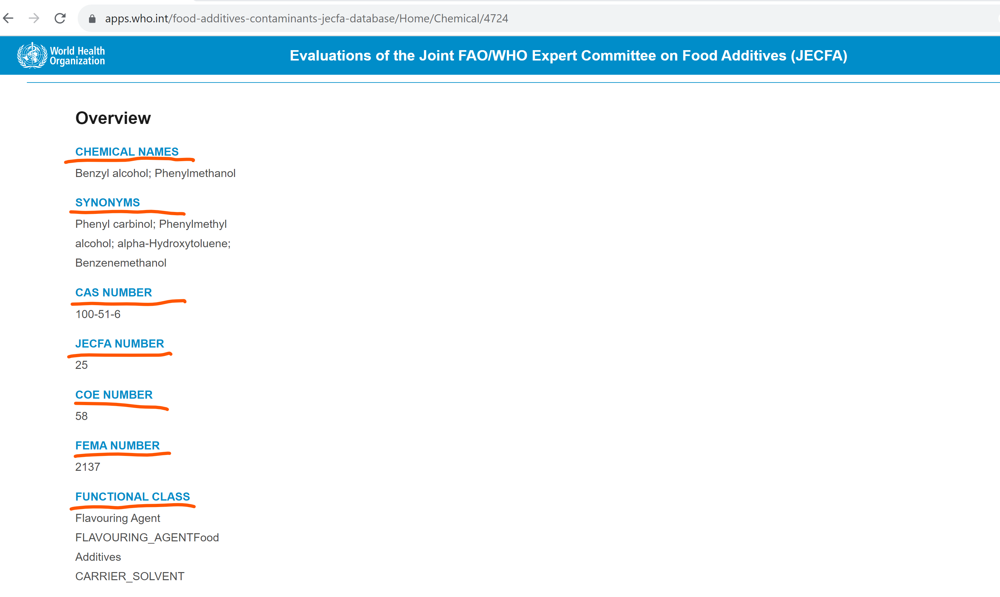
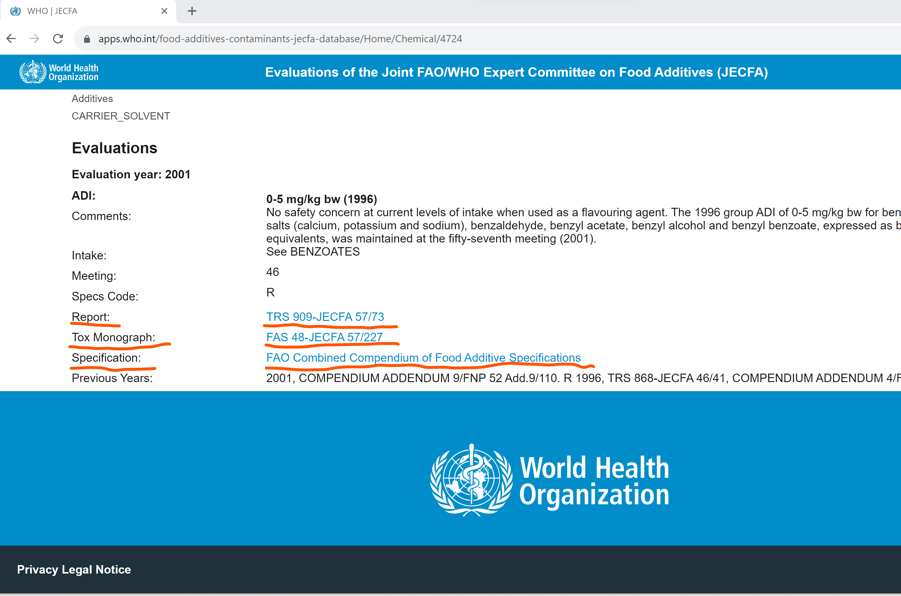

```{r setup, include=FALSE}
knitr::opts_chunk$set(echo = TRUE)
library(tidyverse)
library(gtsummary)
library(targets)
library(pdftools)
library(tesseract)
library(stringdist)
library(httr)
library(DT)
list.files(here::here("R"), full.names = TRUE) |> 
  purrr::walk(source)
```

## Output of webscaping as of DECEMBER 2023 - JEFCA
The process commences with web scraping data from the JECFA portal, data pre-processing is initiated to extract valuable information from both URLs and strings. Notably, experts have singled out the 'Tox.Monograph' field as the most dependable source of information.





In an initial endeavor, an approach was made to directly access documents through the 'Tox.Monograph' links. Unfortunately, this method posed significant challenges due to the data's inherent heterogeneity. These links primarily led to HTML pages, lacking direct access to the desired PDF documents, as elucidated in Table 1.

As a strategic shift, the code now centers its efforts on discerning the 'Tox.Monograph' names within the context of Food Additives Series (FAS), as exemplified in Table 2. This approach is designed to facilitate efficient access to crucial information within the 'Tox.Monograph' field, enhancing its usability for subsequent steps.
Although almost all 85 FAS codes are referenced, the ones collectively accounting for 50% of the records are: 40, 42, 44, 46, 48, 50, 54 and 59.
We accessed and stored all the FAS from https://www.who.int/groups/joint-fao-who-expert-committee-on-food-additives-(jecfa)/publications/toxicological-monographs in pdf format, whenever available, or HTML as the 1st, 4th, 5th, 6th, 8th, 10th, and 12th through 52nd series of FAS monographs are available in HTML format only. WHO monographs beginning with the 51st series are also available in PDF format.

```{r}
jecfa <- tar_read(jecfa_augmented)

datatable(
  jecfa,
  rownames = FALSE,
  filter = list(position = "top"),
  caption = "Overview of jecfa.csv"
)
```

```{r}
tar_read(tbl1)
```

```{r}
tar_read(tbl2)
```

```{r}
tar_read(tbl3)
```

```{r}
tar_read(tbl4)
```

## Download the TRS - (when a FAS is not available) from Report_sourcelink present in jecfa.csv after pre-processing the Report name (n=667)

```{r, eval=F, echo=F, cache=T, message=FALSE}
```
Here's a breakdown of what the code is doing:

1. Cleaning the "Report" column in the dataset:

The code cleans the "Report" column in the dataset (jecfa$Report_clean) by removing unwanted characters at the beginning of the string. If the string starts with '">', it removes the first two characters. This step aims at handling formatting issues in the data.

2. Sanitizing file names:

The code defines a function that replaces characters that are not allowed in file names with underscores. It also removes leading and trailing underscores from the file name.

3. Creating a folder named "TRS":

If the "TRS" folder does not exist in the current directory, the code creates it. This folder is intended to store downloaded PDF files.

4. Extracting PDF URLs:

The code extracts a vector of PDF URLs from the "Report_sourcelink" column in the dataset and assigns it to the variable pdf_urls.

5. Downloading PDFs:

The code enters a loop to process each URL in the pdf_urls vector.
It checks various conditions before attempting to download a PDF:
It skips URLs associated with specific conditions based on values in the dataset (e.g., Monograph "NOT PREPARED" or other conditions).
It checks if the URL is missing or empty and skips such cases.
It verifies that the URL has a valid format (starting with "http://" or "https://").
For URLs that meet the conditions, the code constructs a file name for the PDF file. The file name includes a prefix based on the position in the original dataset and a sanitized version of the "Report_clean" column.
It checks if the PDF file already exists in the "TRS" folder. If not, it proceeds to download the PDF file using the GET function from the httr library.
If the download is successful (status code 200), it saves the PDF file in the "TRS" folder with the constructed file name.
If the download fails or if the file already exists, it logs appropriate messages.

We identified 56 unique PDFs within TRS folder. 

```{r}
tibble(
  in_folder = here::here("data/TRS_unique") |> 
    list.files(),
  in_pipeline = tar_read(trsUnique) |> basename()
) |> 
  datatable(
    rownames = FALSE,
    filter = list(position = "top"),
    caption = "Comparison of PDFs in the TRS folder and the pipeline"
  )
```


## Text mining on TRS (when a FAS is not available)


This code will create a data frame with one row per PDF file, and each column corresponds to a keyword and its list of page matches. The "File" column contains the file name of the PDF.
In details:

1. Extract Text from PDFs: The code uses the pdf_ocr_text function from the pdftools library to extract text from each PDF file. The extracted text is converted to lowercase for consistent searching.

2. Search for Keywords: For each PDF file, the code searches for predefined keywords related to the content of interest, such as "dose-response," "modelling," "bmd", "bmr" and "benchmark-dose" and some variations of these. It records the pages in which these keywords are found within the PDF.

3. Store Results: The results for each PDF file, including the file name and the list of pages where keywords are found, are stored in a list. The list is indexed by the PDF file name.

4. Final Data Frame: Lastly, the code combines the individual results from each PDF file into a final data frame. 

Overall, the code automates the extraction of specific information from a collection of PDF files, making it easier to identify which PDFs contain relevant content based on predefined keywords.

It follows a **Match between JECFA refID (i.e., row names) and the TRS pdf**. 

```{r}
tar_read(TRSKeywordMatching) |>
    mutate(
        matching_pages = matching_pages |> 
            map_chr(str_c, collapse = ", ")
    ) |> 
    datatable(
        rownames = FALSE,
        filter = list(position = "top"),
        caption = "Results of text mining on TRS"
    )
```

## Text mining on FAS (n=73 unique FAS)
The same procedure described for text mining TRS is applied to FAS. The only difference is in the way the pdfs are accessed.

```{r}
tar_read(FASKeywordMatching) |>
    mutate(
        matching_pages = matching_pages |> 
            map_chr(str_c, collapse = ", ")
    ) |> 
    datatable(
        rownames = FALSE,
        filter = list(position = "top"),
        caption = "Results of text mining on TRS"
    )

```


It follows a **match between JECFA refID and the FAS pdf **

```{r}
tar_read(jecfa_tm_full) |> 
    datatable(
        rownames = FALSE,
        filter = list(position = "top"),
        caption = "Results of text mining on JECFA"
    )

```

## Description of jecfa records with text mining on FAS or TRS
```{r}
tar_read(tbl5)
```

```{r}
tar_read(tbl6)
```


```{r}
tar_read(tbl7)
```

```{r}
tar_read(tbl8)
```

```{r}
tar_read(tbl9)
```


## Filtering of jecfa records by bmd, bmr or benchmark dose and identify unique records (N= 1122)

```{r}
tar_read(tbl10)
```


```{r}
# ## CL: TO CHECK!!!!!!!!!!!!!!!   WHY MERGE AGAIN WITH JECFA_TM????
# JecfatoDistiller <- merge(maptoJecfa_filter[, c(1:22, 32:34)], jecfa_TM[, c(-1, -11)], by = "RefID", all.x = T)

tar_read(jecfaDistiller) |> 
    datatable(
        rownames = FALSE,
        filter = list(position = "top"),
        caption = "Results of text mining on JECFA"
    )
```

## Retrive pdf to upload into DistillerSR

```{r}
usethis::ui_done(
  "{tar_read(fileUsed) |> basename()} copied."
)
```
